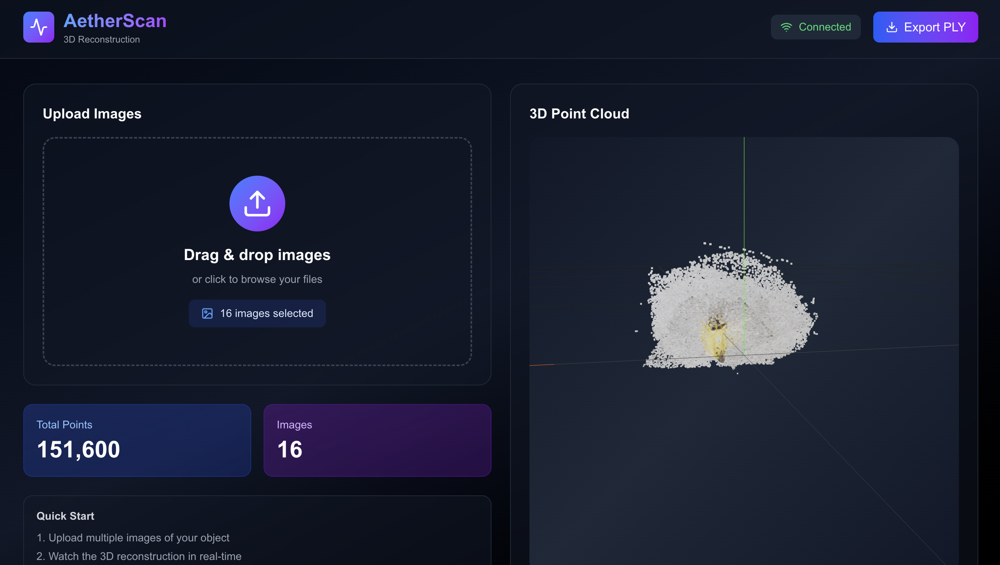

# AetherScan

A high-performance 3D reconstruction web application with GPU-accelerated backend and real-time point cloud streaming.

## UI Preview



## Features

- 🚀 **GPU-Accelerated**: FastAPI backend with CUDA support for fast 3D reconstruction
- 🌊 **Real-time Streaming**: WebSocket-based point cloud streaming from backend to frontend
- 🎨 **WebGPU Rendering**: Efficient rendering of 1M+ points using React Three Fiber
- 📦 **Docker Ready**: Complete containerization with GPU support
- 🔄 **Hot Reload**: Development workflow with live reloading

## Tech Stack

### Frontend

- Next.js 15 (App Router)
- React 19
- React Three Fiber (3D rendering)
- Tailwind CSS
- Lucide Icons
- WebSocket client

### Backend

- FastAPI (Python 3.12)
- PyTorch with CUDA
- Fast3R (3D reconstruction)
- WebSocket support
- PLY export utility

## Prerequisites

- Docker & Docker Compose
- NVIDIA GPU with CUDA support
- NVIDIA Container Toolkit
- **Local dev only**: [Miniconda/Anaconda](https://docs.conda.io/en/latest/miniconda.html) with Python 3.11 (`conda create -n aether python=3.11`)

## Quick Start

### Development

1. **Clone the repository**

   ```bash
   git clone <repository-url>
   cd AetherScan
   ```

2. **Start all services**

   ```bash
   docker-compose up
   ```

3. **Access the application**
   - Frontend: http://localhost:3000
   - Backend API: http://localhost:8000
   - API Docs: http://localhost:8000/docs

### GPU Verification

Check if the backend has GPU access:

```bash
docker-compose exec backend python -c "import torch; print(f'GPU Available: {torch.cuda.is_available()}')"
```

## Project Structure

```
AetherScan/
├── frontend/              # Next.js 15 application
│   ├── app/              # App router pages
│   ├── components/       # React components
│   ├── hooks/            # Custom React hooks
│   └── Dockerfile        # Frontend container
├── backend/              # FastAPI server
│   ├── services/         # Business logic
│   ├── utils/            # Utilities
│   ├── main.py          # Application entry
│   ├── requirements.txt  # Python dependencies
│   └── Dockerfile       # Backend container with CUDA
├── shared/              # Shared types/schemas
└── docker-compose.yml   # Service orchestration
```

## Usage

1. **Upload Images**: Drag and drop images into the upload zone
2. **Watch Live**: Point cloud appears in real-time as backend processes images
3. **Export**: Download the complete point cloud as a .PLY file

## Development

### Frontend Only

```bash
cd frontend
npm install
npm run dev
```

### Backend Only

> **Requires Python 3.11** (Fast3R has strict version constraints). Use the `aether` conda env:

```bash
# 1. Activate the conda environment
conda activate aether

# 2. Install Python dependencies
cd backend
pip install -r requirements.txt

# 3. Clone Fast3R (includes DUSt3R and CroCo submodules)
git clone --recursive https://github.com/facebookresearch/fast3r.git ../fast3r

# 4. Install Fast3R as an editable package (one-time)
pip install -e ../fast3r

# 5. Start the backend
uvicorn main:app --reload --host 0.0.0.0 --port 8000
```

## Environment Variables

### Frontend

- `NEXT_PUBLIC_BACKEND_WS`: WebSocket endpoint (default: `ws://localhost:8000`)
- `NEXT_PUBLIC_BACKEND_HTTP`: HTTP endpoint (default: `http://localhost:8000`)

### Backend

- `PYTHONUNBUFFERED`: Enable real-time logging (default: `1`)

## License

MIT
